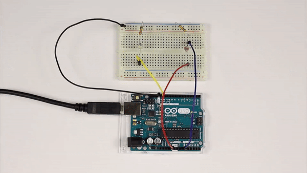
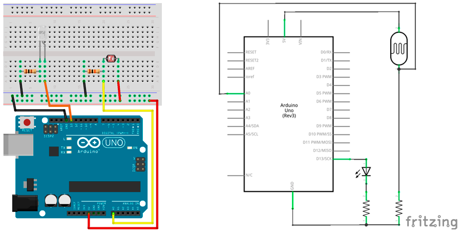

# Encendido nocturno



En esta práctica tenemos que programar utilizando un sensor LDR el encendido nocturno de un led.

1.  [Materiales](#materiales)
2.  [Esquema eléctrico](#esquema-eléctrico)
3.  [Programación en mBlock](#programación-en-mBlock)
4.  [Programación en Arduino](#programación-en-arduino)


---


<br><br>


## Materiales

Para llevar a cabo la práctica, vamos a necesitar los siguientes materiales:
- 1 Placa de Arduino UNO
- 1 Protoboard
- 4 latiguillos
- 2 resistencias
- 1 sensor LDR
- 1 diodo led


<br /><br />


## Esquema eléctrico

Teniendo en cuenta las características técnicas de los diodos led que utilizamos en esta práctica, calculamos la resistencia del circuito aplicando la Ley de Ohm.

Para realizar el montaje correctamente en nuestra placa de prototipado, necesitaremos conectar una resistencia al circuito (Pull-Down o Pull-Up). Estas dos resistencias son un mecanismo básico y habitual dentro del mundo de la electrónica.
- La resistencia de Pull-Up fuerza HIGH cuando el pulsador está abierto. Cuando está cerrado el PIN se pone a LOW, la intensidad que circula se ve limitada por esta resistencia.
- La resistencia de Pull-Down fuerza LOW cuando el pulsador está abierto. Cuando está cerrado el PIN se pone a HIGH, y la intensidad que circula se ve limitada por esta resistencia.

| Sensor LDR                        |       |
| --------------------------------- | ----- |
| Polarizado                        | No    |
| Resistencia mínima (con luz)      | 100Ω  |
| Resistencia máxima (sin luz)      | 1MΩ   |

El valor de la resistencia viene condicionado por la intensidad que pasa por el sensor LDR. En este caso podemos tomar una resistencia de 10KΩ.

Por otro lado, hay añadir un led al circuito con su respectiva resistencia como hemos calculado en prácticas anteriores.

```
V = 1,7V
I = 20mA

V = I x R ; R = V / I

R = 1,7V / 0,02A = 85Ω 
```

Se conectan los componentes sobre la placa de prototipado.




<br /><br />


## Programación en mBlock

Fijándonos en el diagrama de flujo programamos la práctica mediante lenguaje de programación por bloques mBlock. 


<br /><br />


## Programación en Arduino

Al igual que en el apartado anterior, programamos en Arduino IDE la práctica propuesta.

```
/**
 * Encendido nocturno
 *
 * En esta práctica tenemos que programar utilizando un sensor LDR
 * el encendido nocturno de un led.
 *
 * @author Miguel Ángel Abellán
 * @company Programo Ergo Sum
 * @license Creative Commons. Reconocimiento CompartirIgual 4.0
 */

// Se definen las variables de tipo entero
int ledPin = 13;
int ldrPin = 0;
int limite = 150;

//Este código se ejecuta la primera vez
void setup() {
  // Configuramos el pin en modo salida
  pinMode(ledPin, OUTPUT);
  pinMode(ldrPin, INPUT);
}

//Este código se ejecuta en bucle repetidamente
void loop() {

  // Lectura del pin del interruptor
  if (analogRead(ldrPin) > limite) {
    digitalWrite(ledPin, HIGH);
  }
  else {
    digitalWrite(ledPin, LOW);
  }
}
```


---


<br>
Esta obra está bajo una licencia de [Creative Commons Reconocimiento-CompartirIgual 4.0 Internacional](https://creativecommons.org/licenses/by-sa/4.0/deed.es_ES).
