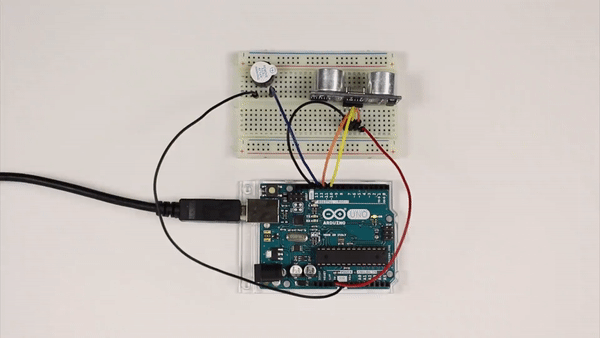
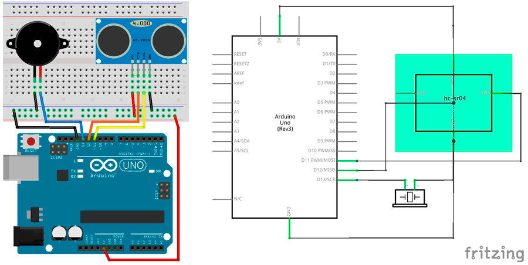
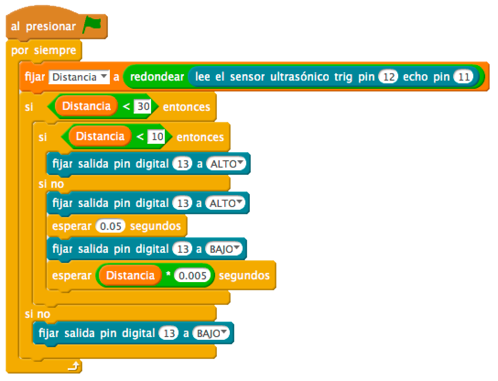

# Detector de aparcamiento



En esta práctica vamos a calcular la distancia de aparcamiento en un vehículo mostrando una señal acústica a medida se va acercando al obstáculo.
 
1.  [Materiales](#materiales)
2.  [Esquema eléctrico](#esquema-eléctrico)
3.  [Programación en mBlock](#programación-en-mBlock)
4.  [Programación en Arduino](#programación-en-arduino)


---


<br><br>


## Materiales

Para llevar a cabo la práctica, vamos a necesitar los siguientes materiales:
- 1 Placa de Arduino UNO
- 1 Protoboard
- 6 latiguillos
- 1 Sensor de ultrasonidos
- 1 Zumbador


<br /><br />


## Esquema eléctrico

Teniendo en cuenta las características técnicas de los diodos led que utilizamos en esta práctica, calculamos la resistencia del circuito aplicando la Ley de Ohm.

| Sensor de proximidad HC-SR04  |           |
| ----------------------------- | --------- |
| Polarizado                    | Si        |
| Señal de salida               | Digital   |
| Tensión                       | 5V        |
| Rango de medición             | 2cm a 4m  |

Para calcular la distancia tenemos que ayudarnos de la velocidad del sonido para obtener los cálculos. Hay que tener en cuenta que el resultado es el tiempo en ida + vuelta.

```
Velocidad del sonido: 343 m/s
```

Se conectan los componentes sobre la placa de prototipado.




<br /><br />


## Programación en mBlock

Fijándonos en el diagrama de flujo programamos la práctica mediante lenguaje de programación por bloques mBlock. 




<br /><br />


## Programación en Arduino

Al igual que en el apartado anterior, programamos en Arduino IDE la práctica propuesta.

```
/**
 * Detector de aparcamiento
 * 
 * En esta práctica vamos a calcular la distancia de aparcamiento en un 
 * vehículo mostrando una señal acústica a medida se va acercando al
 * obstáculo.
 * 
 * @author Miguel Ángel Abellán
 * @company Programo Ergo Sum
 * @license Creative Commons. Reconocimiento CompartirIgual 4.0
 */

// Se definen las variables de tipo entero
int zumbadorPin = 13;
int trigPin = 12;
int echoPin = 11;

//Este código se ejecuta la primera vez
void setup() {
  Serial.begin (9600);
  pinMode(zumbadorPin, OUTPUT);
  pinMode(trigPin, OUTPUT);
  pinMode(echoPin, INPUT);

  //Inicialización  de los pines
  digitalWrite(zumbadorPin, LOW);
  digitalWrite(trigPin, LOW);
}

//Este código se ejecuta en bucle repetidamente
void loop() {
  
  //Enviamos un pulso durante 10µs
  digitalWrite(trigPin, HIGH);
  delayMicroseconds(10);
  digitalWrite(trigPin, LOW);

  //Obtenemos la duración del pulso (ida+vuelta) en µs
  long tiempo;
  tiempo = pulseIn(echoPin, HIGH);

  //Calculamos la distancia. Velocidad Sonido = 343 m/s
  float distancia = 34300*tiempo*0.000001;
  distancia = distancia / 2; //Solo IDA

  Serial.print("Distancia: ");
  Serial.println(distancia);
  
  //Encendemos el zumbador si estamos a menos de 30 cms
  if(int(distancia)<30){
    //Encendemos el zumbador si estamos a menos de 10 cms
    if(int(distancia)<10){
      digitalWrite(zumbadorPin, HIGH);
    }else{
      digitalWrite(zumbadorPin, HIGH);
      delay(50);
      digitalWrite(zumbadorPin, LOW);
      delay(distancia*5);
    }
  }else{
    digitalWrite(zumbadorPin, LOW);
  }
}
```


---


<br>
Esta obra está bajo una licencia de [Creative Commons Reconocimiento-CompartirIgual 4.0 Internacional](https://creativecommons.org/licenses/by-sa/4.0/deed.es_ES).