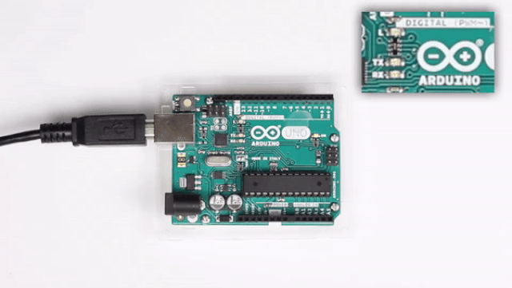
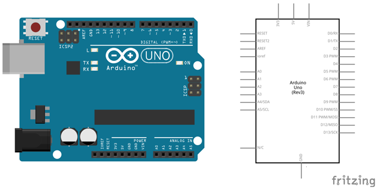

# Hola Mundo

En este práctica se va a programar el código encargado de encender y apagar el led situado junto el pin número 13 de nuestra placa de Arduino. Deberá encenderse y apagarse con una frecuencia de 1 segundo.



| Autor      | Miguel Ángel Abellán |
| :---       | :---                 |
| Dificultad | 1/5 (Muy fácil)      |

---


<br><br>


## Materiales

- 1 Arduino UNO


<br><br>


## Esquema eléctrico

Para esta práctica solamente vamos a utilizar la placa de arduino la cual deberá conectarse al ordenador utilizando el cable USB.




<br><br>


## Programación en mBlock

Para realizar la práctica utilizando mBlock, deberás haber configurado y cargado el firmware que hace de intermediario entre la placa y el programa mBlock. El siguiente paso será programar el código encargado de encender y apagar el pin digital 13 (el cual tiene contiene un led en la placa).


<br><br>


## Programación en Arduino

Para programar el código utilizando el lenguaje de programación de Arduino IDE, recuerda elegir el puerto correcto. El siguiente paso será programar el código encargado de encender y apagar el pin digital 13 (el cual tiene contiene un led en la placa). Fíjate además que estamos indicando a Arduino que el pin digital 13 tiene que tratarlo como salida.

```cpp+lineNumbers:true
/**
 * Hola Mundo
 */

void setup() {
    pinMode(13, OUTPUT);
}

void loop() {
    digitalWrite(13, HIGH);
    delay(1000);
    digitalWrite(13, LOW);
    delay(1000);
}
```