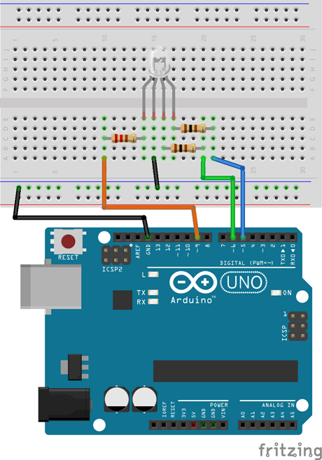
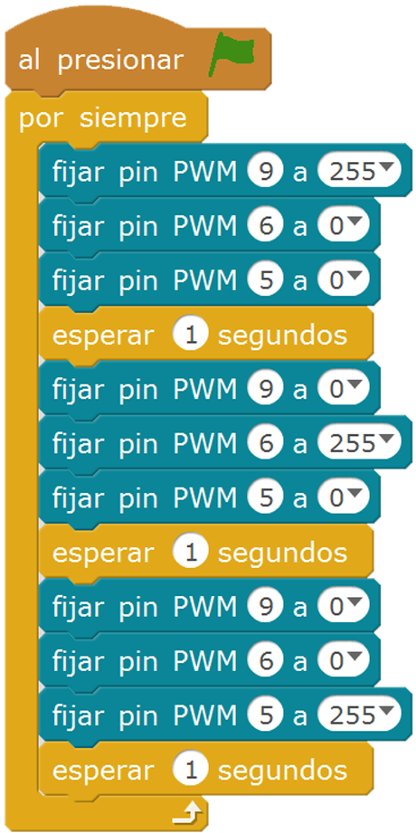

# Práctica 3: LED RGB (cátodo común)

En esta práctica se va a encender un Led RGB de cátodo común en sus 3 colores básicos rojo, verde y azul. Aunque esta práctica se podría realizar utilizando salidas digitales, se va a realizar utilizando salidas analógicas con valores de 255.


---


<br><br>


## Materiales

- 1 Arduino UNO
- 1 Protoboard
- 4 Latiguillos
- 1 LED RGB de cátodo común
- 1 Resistencias de 100Ω (marrón-negro-marrón)
- 2 Resistencias de 220Ω (rojo-rojo-marrón)


<br><br>


## Esquema eléctrico


| Diodo Led RGB (cátodo común)     |          |
| -------------------------------- | -------- |
| Polarizado                       | Negativo |
| Itensidad de Corriente           | 20mA     |
| Tensión en Led (rojo)            | 2,1V     |
| Tensión en Led (verde)           | 3,3V     |
| Tensión en Led (azul)            | 3,3V     |

**Cálculo de la resistencia para el LED RGB (rojo)**

```
V = 2,9V
I = 20mA

V = I x R ; R = V / I

R = 2,9V / 0,02A = 145Ω 
```

**Cálculo de la resistencia para el LED RGB (verde-azul)**

```
V = 1,7V
I = 20mA

V = I x R ; R = V / I

R = 1,7V / 0,02A = 85Ω 
```

La patilla más larga del LED RGB de cátodo común se conecta al pin GND de la placa de arduino para que esté polarizado positivamente. La patilla que queda a la izquierda corresponde al color rojo, el cual se conectará con su debida resistencia. Las otras dos patillas corresponden a los colores verde y azul por orden. También habrá que conectarlas a sus resistencias que además son de menor valor.




<br><br>


## Programación en mBlock

Al ejecutar el código se activará cada uno de los pines encargados de encender el LED RGB. En este caso, al estar utilizando un LED RGB de cátodo común para encender el color rojo tendremos que polarizar el color que queremos visualizar, dicho de otro modo, tendremos que establecer a un valor alto el pin conectado a la patilla del color rojo y un valor bajo a las patillas del color verde y azul.




<br><br>


## Programación en Arduino

En primer lugar, se configura los pines analógicos PWM 9, 6 y 5 en modo salida (OUTPUT). Esta configuración se establece en la función setup(), ya que solamente se ejecuta una vez.

Por otro lado, al ejecutar el código se activará cada uno de los pines encargados de encender el LED RGB. En este caso, al estar utilizando un LED RGB de cátodo común para encender el color rojo tendremos que polarizar el color que queremos visualizar, dicho de otro modo, tendremos que establecer a un valor alto el pin conectado a la patilla del color rojo y un valor bajo a las patillas del color verde y azul. Además se crea un retardo de 1 segundo (1000 milisegundos) para apreciar el efecto de cambio de color.

```
/**
 * Led RGB (cátodo común)
 * 
 * @author Miguel Ángel Abellán
 * @company Programo Ergo Sum
 * @license Creative Commons. Reconocimiento CompartirIgual 4.0
 */

void setup() {
  pinMode(9, OUTPUT);
  pinMode(6, OUTPUT);
  pinMode(5, OUTPUT);
}

void loop() {
  analogWrite(9, 255);
  analogWrite(6, 0);
  analogWrite(5, 0);
  delay(1000);
  analogWrite(9, 0);
  analogWrite(6, 255);
  analogWrite(5, 0);
  delay(1000);
  analogWrite(9, 0);
  analogWrite(6, 0);
  analogWrite(5, 255);
  delay(1000);
}
```


---


<br>
Esta obra está bajo una licencia de [Creative Commons Reconocimiento-CompartirIgual 4.0 Internacional](https://creativecommons.org/licenses/by-sa/4.0/deed.es_ES).

2018 [Asociación Programo Ergo Sum](https://www.programoergosum.com)