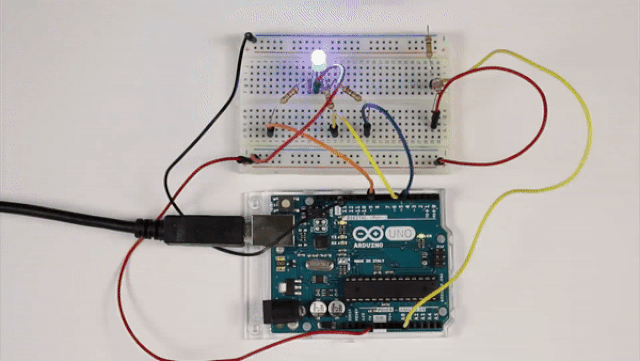
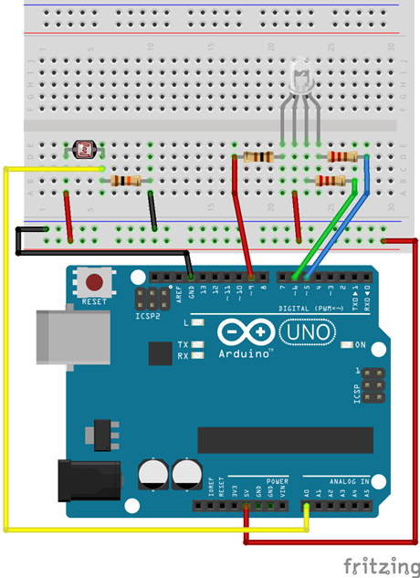

# Práctica 2: LED RGB crepuscular

El objetivo de esta práctica es cambiar los colores de un LED RGB utilizando un sensor de luz LDR, es decir, queremos que se encienda en diferentes colores a medida que oscurece pasando por una gama de colores. Para ello utilizaremos un sensor LDR y un LED RGB de ánodo común.




---


<br><br>


## Materiales

- 1 Arduino UNO
- 1 Protoboard
- 7 Latiguillos
- 1 LED RGB de ánodo común
- 1 Sensor LDR
- 1 Resistencia de 100Ω (marrón-negro-marrón)
- 2 Resistencia de 220Ω (rojo-rojo-marrón)
- 1 Resistencia de 10KΩ (marrón-negro-naranja)


<br /><br />


## Esquema eléctrico

| Sensor LDR                        |       |
| --------------------------------- | ----- |
| Polarizado                        | No    |
| Resistencia mínima (con luz)      | 100Ω  |
| Resistencia máxima (sin luz)      | 1MΩ   |

| Diodo Led RGB (ánodo común)      |          |
| -------------------------------- | -------- |
| Polarizado                       | Positivo |
| Itensidad de Corriente           | 20mA     |
| Tensión en Led (rojo)            | 2,1V     |
| Tensión en Led (verde)           | 3,3V     |
| Tensión en Led (azul)            | 3,3V     |

**Cálculo de la resistencia para el LED RGB (rojo)**

```
V = 2,9V
I = 20mA

V = I x R ; R = V / I

R = 2,9V / 0,02A = 145Ω 
```

**Cálculo de la resistencia para el LED RGB (verde-azul)**

```
V = 1,7V
I = 20mA

V = I x R ; R = V / I

R = 1,7V / 0,02A = 85Ω 
```

Por un lado se conecta el LED RGB de ánodo común a los pines 9, 6 y 5 (RGB) de la placa de arduino (utilizando su debida resistencia). Por otro lado, se conecta el sensor LDR al pin de entrada analógica 0 de la placa de arduino (utilizando la resistencia en modo Pull-Down).




<br /><br />


## Programación en mBlock

Al ejecutar el código se calcula el valor analógico del sensor LDR y mediante condiciones creamos los diferentes casos; si es mayor que 600 se enciende el color rojo (mediante una llamada por eventos), si el valor está entre 300 y 600 se encenderá el color verde, y si es menor que 300 se encenderá el color azul.


<br /><br />


## Programación en Arduino

En primer lugar, se configuran los pines analógicos 9, 6 y 5 en modo salida (OUTPUT). Esta configuración se establece en la función setup(), ya que solamente se ejecuta una vez.

Por otro lado, al ejecutar el código se calcula el valor analógico del sensor LDR y mediante condiciones creamos los diferentes casos; si es mayor que 600 se enciende el color rojo, si el valor está entre 300 y 600 se encenderá el color verde, y si es menor que 300 se encenderá el color azul.

```
/**
 * Led RGB crepuscular
 * 
 * @author Miguel Ángel Abellán
 * @company Programo Ergo Sum
 * @license Creative Commons. Reconocimiento CompartirIgual 4.0
 */

void setup() {
  pinMode(9, OUTPUT);
  pinMode(6, OUTPUT);
  pinMode(5, OUTPUT);

  analogWrite(9, 0);
  analogWrite(6, 0);
  analogWrite(5, 0);
}

void loop() {
  if (analogRead(0) < 300) {
    analogWrite(9, 0);
    analogWrite(6, 255);
    analogWrite(5, 255);
  } else if (analogRead(0) < 600) {
    analogWrite(9, 255);
    analogWrite(6, 0);
    analogWrite(5, 255);
  } else {
    analogWrite(9, 255);
    analogWrite(6, 255);
    analogWrite(5, 0);
  }
}
```


---


<br>
Esta obra está bajo una licencia de [Creative Commons Reconocimiento-CompartirIgual 4.0 Internacional](https://creativecommons.org/licenses/by-sa/4.0/deed.es_ES).

2018 [Asociación Programo Ergo Sum](https://www.programoergosum.com)