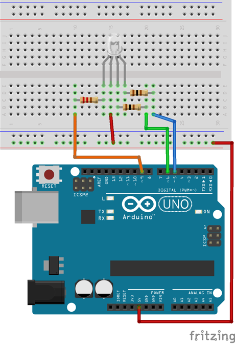
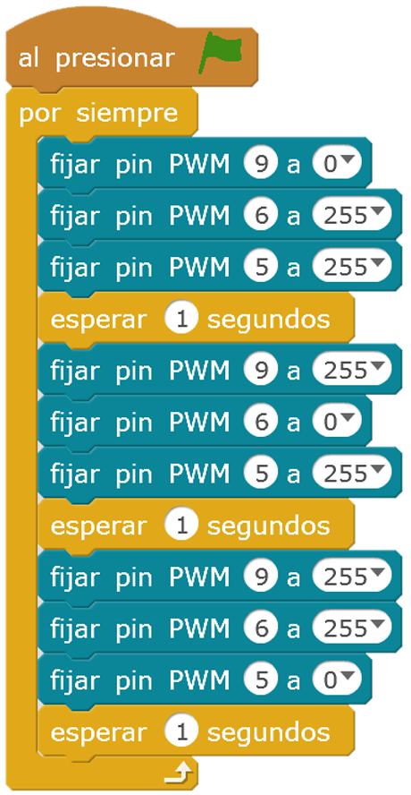

# Led RGB


En esta práctica vamos a visualizar los colores rojos, verde y azul alimentando para cada color una sola parte gracias al uso de pines PWM de la placa de Arduino.

1.	[Materiales](#materiales)
2.	[Esquema eléctrico](#esquema-eléctrico)
3.	[Programación en mBlock](#programación-en-mblock)
4.	[Programación en Arduino](#programación-en-arduino)


---


<br><br>


## Materiales

Para llevar a cabo la práctica, vamos a necesitar los siguientes materiales:
- 1 Placa de Arduino UNO
- 1 Protoboard
- 4 latiguillos
- 1 Diodo Led RGB (ánodo común)
- 3 Resistencia


<br><br>


## Esquema eléctrico

Teniendo en cuenta las características técnicas de los diodos led que utilizamos en esta práctica, calculamos la resistencia del circuito aplicando la Ley de Ohm.

| Diodo Led RGB (ánodo común)      |        |
| -------------------------------- | ------ |
| Polarizado                       | Sí     |
| Diámetro                         | 5mm    |
| Itensidad de Corriente           | 20mA   |
| Tensión en Led (rojo)            | 2,1V   |
| Tensión en Led (verde)           | 3,3V   |
| Tensión en Led (azul)            | 3,3V   |

```
LED ROJO

V = 2,9V
I = 20mA

V = I x R ; R = V / I

R = 2,9V / 0,02A = 145Ω 

--

LED VDERDE Y AZUL

V = 1,7V
I = 20mA

V = I x R ; R = V / I

R = 1,7V / 0,02A = 85Ω 
```

Se conectan los componentes sobre la placa de prototipado.




<br><br>


## Programación en mBlock

La programación de esta práctica consiste en encender los diferentes colores del led RGB.




<br><br>


## Programación en Arduino

Al igual que en el apartado anterior, programamos en Arduino IDE la práctica propuesta.

```
/**
 * Led RGB (ánodo común)
 * 
 * @author Miguel Ángel Abellán
 * @company Programo Ergo Sum
 * @license Creative Commons. Reconocimiento CompartirIgual 4.0
 */

void setup() {
  pinMode(9, OUTPUT);
  pinMode(6, OUTPUT);
  pinMode(5, OUTPUT);
}

void loop() {
  analogWrite(9, 0);
  analogWrite(6, 255);
  analogWrite(5, 255);
  delay(1000);
  analogWrite(9, 255);
  analogWrite(6, 0);
  analogWrite(5, 255);
  delay(1000);
  analogWrite(9, 255);
  analogWrite(6, 255);
  analogWrite(5, 0);
  delay(1000);
}
```


---


<br>
Esta obra está bajo una licencia de [Creative Commons Reconocimiento-CompartirIgual 4.0 Internacional](https://creativecommons.org/licenses/by-sa/4.0/deed.es_ES).
