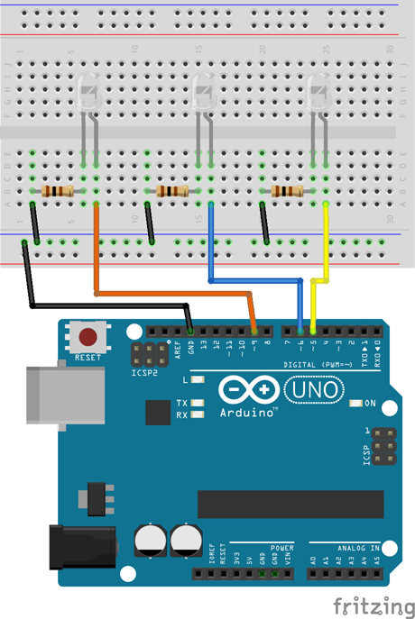

# Luces aleatorias


En esta práctica vamos a encender de forma aleatoria 3 Diodos Led de color blanco utilizando las salidas analógicas. Para ello utilizaremos valores aleatorios comprendidos entre 0 y 255 para representar los diferentes valores.

1.	[Materiales](#materiales)
2.	[Esquema eléctrico](#esquema-eléctrico)
3.	[Programación en mBlock](#programación-en-mblock)
4.	[Programación en Arduino](#programación-en-arduino)


---


<br><br>


## Materiales

Para llevar a cabo la práctica, vamos a necesitar los siguientes materiales:
- 1 Placa de Arduino UNO
- 1 Protoboard
- 4 latiguillos
- 3 Diodos Led (blancos)
- 3 Resistencia 100Ω


<br><br>


## Esquema eléctrico

Teniendo en cuenta las características técnicas de los diodos led que utilizamos en esta práctica, calculamos la resistencia del circuito aplicando la Ley de Ohm.

| Diodos Led                       |        |
| -------------------------------- | ------ |
| Polarizado                       | Sí     |
| Itensidad de Corriente           | 20mA   |
| Tensión Led (verde, ámbar, rojo) | 2,1V   |
| Tensión Led blanco               | 3,3V   |


```
V = 1,7V
I = 20mA

V = I x R ; R = V / I

R = 1,7V / 0,02A = 85Ω 
```

Se conectan los componentes sobre la placa de prototipado.




<br><br>


## Programación en mBlock

Para realizar la práctica utilizando mBlock, deberás haber configurado y cargado el firmware que hace de intermediario entre la placa y el programa mBlock. El siguiente paso será programar el código encargado regular los valores de los led. Fíjate como el número aleatorio está comprendido entre 0 y 255.


<br><br>


## Programación en Arduino

Para programar el código utilizando el lenguaje de programación de Arduino IDE, recuerda elegir el puerto correcto. El siguiente paso será programar el código encargado regular los valores de los led. Fíjate como el número aleatorio está comprendido entre 0 y 255.

```
/**
 * Luces de navidad
 *  
 * @author Miguel Ángel Abellán
 * @company Programo Ergo Sum
 * @license Creative Commons. Reconocimiento CompartirIgual 4.0
 */

void setup() {
  pinMode(9, OUTPUT);
  pinMode(6, OUTPUT);
  pinMode(5, OUTPUT);
}

void loop() {
  analogWrite(9, random(0, 255));
  analogWrite(6, random(0, 255));
  analogWrite(5, random(0, 255));
  delay(500);
}
```


---


<br>
Esta obra está bajo una licencia de [Creative Commons Reconocimiento-CompartirIgual 4.0 Internacional](https://creativecommons.org/licenses/by-sa/4.0/deed.es_ES).
