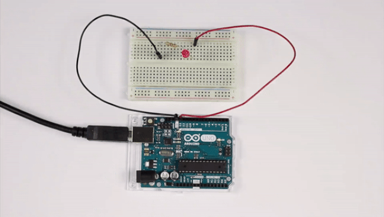

# Luz intermitente



En esta práctica se va a construir y a programar un diodo Led que parpadea continuamente con una frecuencia de 1 segundo.

1.	[Materiales](#materiales)
2.	[Esquema eléctrico](#esquema-eléctrico)
3.	[Programación en mBlock](#programación-en-mblock)
4.	[Programación en Arduino](#programación-en-arduino)


---


<br><br>


## Materiales

Para llevar a cabo la práctica vamos a necesitar los siguientes componentes:
- 1 Placa de Arduino UNO
- 1 Protoboard
- 2 latiguillos
- 1 Diodo Led
- 1 Resistencia de 220Ω


<br><br>


## Esquema eléctrico

Teniendo en cuenta las características técnicas de los diodos led que utilizamos en esta práctica, calculamos la resistencia del circuito aplicando la Ley de Ohm.

| Diodos Led                       |        |
| -------------------------------- | ------ |
| Polarizado                       | Sí     |
| Itensidad de Corriente           | 20mA   |
| Tensión Led (verde, ámbar, rojo) | 2,1V   |
| Tensión Led blanco               | 3,3V   |


```
V = 2,9V
I = 20mA

V = I x R ; R = V / I

R = 2,9V / 0,02A = 145Ω -> 220Ω (por aproximación)
```

Se conectan los componentes sobre la placa de prototipado.


<br><br>


## Programación en mBlock

Para encender y apagar el led de forma intermitente, utilizamos un bucle repetir. Dentro del bucle se añaden las instrucciones de apagar y encender el led, dejando una espera de 1 segundo.


<br><br>


## Programación en Arduino

Al igual que en el apartado anterior, programamos en Arduino IDE la práctica propuesta.

```
/**
 * Luz intermitente
 * 
 * En esta práctica se va a construir y programar un diodo Led que parpadea
 * continuamente con una frecuencia de 1 segundo.
 * 
 * @author Miguel Ángel Abellán
 * @company Programo Ergo Sum
 * @license Creative Commons. Reconocimiento CompartirIgual 4.0
 */
 
// Se definen las variables de tipo entero
int ledPin = 13;
int delayTime = 1000;

//Este código se ejecuta la primera vez
void setup() {
  // Configuramos el pin en modo salida
  pinMode(ledPin, OUTPUT);
}

//Este código se ejecuta en bucle repetidamente
void loop() {
  // Se enciende el led
  digitalWrite(ledPin, HIGH);
  // Esperamos 
  delay(delayTime);
  // Se apaga el led
  digitalWrite(ledPin, LOW);
  // Esperamos 
  delay(delayTime);
}
```


---


<br>
Esta obra está bajo una licencia de [Creative Commons Reconocimiento-CompartirIgual 4.0 Internacional](https://creativecommons.org/licenses/by-sa/4.0/deed.es_ES).