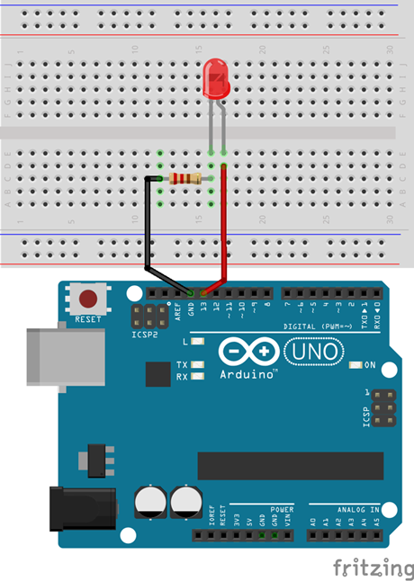
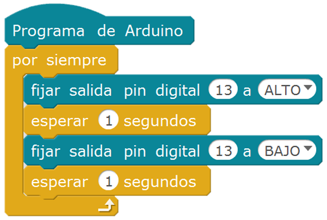

# Luz intermitente


En esta práctica se va a programar el código encargado de encender y apagar un led conectado al pin número 13 de nuestra placa de arduino. Deberá encenderse y apagarse con una frecuencia de 1 segundo.

1.	[Materiales](#materiales)
2.	[Esquema eléctrico](#esquema-eléctrico)
3.	[Programación en mBlock](#programación-en-mblock)
4.	[Programación en Arduino](#programación-en-arduino)


---


<br><br>


## Materiales

Para llevar a cabo la práctica vamos a necesitar los siguientes componentes:
- 1 Placa de Arduino UNO
- 1 Protoboard
- 2 latiguillos
- 1 Diodo Led
- 1 Resistencia de 220Ω (rojo-rojo-marrón)


<br><br>


## Esquema eléctrico

Teniendo en cuenta las características técnicas de los diodos led que utilizamos en esta práctica, calculamos la resistencia del circuito aplicando la Ley de Ohm.

| Diodos Led                       |        |
| -------------------------------- | ------ |
| Polarizado                       | Sí     |
| Itensidad de Corriente           | 20mA   |
| Tensión Led (verde, ámbar, rojo) | 2,1V   |
| Tensión Led blanco               | 3,3V   |


```
V = 2,9V
I = 20mA

V = I x R ; R = V / I

R = 2,9V / 0,02A = 145Ω -> 220Ω (por aproximación)
```

Se conectan los componentes sobre la placa de prototipado.




<br><br>


## Programación en mBlock

Para realizar la práctica utilizando mBlock, deberás haber configurado y cargado el firmware que hace de intermediario entre la placa y el programa mBlock. El siguiente paso será programar el código encargado de encender y apagar el pin digital 13.




<br><br>


## Programación en Arduino

Para programar el código utilizando el lenguaje de programación de Arduino IDE, recuerda elegir el puerto correcto. El siguiente paso será programar el código encargado de encender y apagar el pin digital 13 (el cual tiene contiene un led en la placa). Fíjate además que estamos indicando a Arduino que el pin digital 13 tiene que tratarlo como salida.

```
/**
 * Luz intermitente
 * 
 * @author Miguel Ángel Abellán
 * @company Programo Ergo Sum
 * @license Creative Commons. Reconocimiento CompartirIgual 4.0
 */

void setup() {
	pinMode(13, OUTPUT);
}

void loop() {
	digitalWrite(13, HIGH);
	delay(1000);
	digitalWrite(13, LOW);
	delay(1000);
}
```


---


<br>
Esta obra está bajo una licencia de [Creative Commons Reconocimiento-CompartirIgual 4.0 Internacional](https://creativecommons.org/licenses/by-sa/4.0/deed.es_ES).