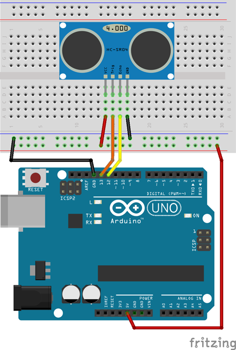

# Práctica 2: Medidor de distancia con ultrasonidos

El objetivo de esta práctica es medir la distancia entre objetos próximos comprendidos entre unos cuantos centímetros. Para ello se va a utilizar un sensor de ultrasonidos.


---


<br><br>


## Materiales

- 1 Arduino UNO
- 1 Protoboard
- 4 Latiguillos
- 1 Ultrasonidos


<br /><br />


## Esquema eléctrico

| Sensor de proximidad HC-SR04  |           |
| ----------------------------- | --------- |
| Polarizado                    | Si        |
| Tensión                       | 5V        |
| Rango de medición             | 2cm a 4m  |

Fijándonos en los pines del sensor de ultrasonidos, se conecta el pin Vcc al pin 5V de la placa de arduino, el GND al GND de la placa de arduino, y los pines triger y echo a los pines 13 y 12 respectivamente.




<br /><br />


## Programación en mBlock

Al ejecutar el código se deberá detectar la distancia mediante el bloque que devuelve la distancia en centímetros. Además el valor se guardará en una variable para mostrarla por la pantalla.


<br /><br />


## Programación en Arduino

En primer lugar, se configura el pin digitales 13 en modo salida (OUTPUT) y el pin digital 12 en modo entrada (INPUT). Esta configuración se establece en la función setup(), ya que solamente se ejecuta una vez. Además se establece el pin digital 13 a un valor bajo (LOW).

Al ejecutar el código se establece el pin digital 13 a un valor alto (HIGH) y bajo (LOW) rápidamente durante 10 microsegundos. Este es el estado que cambia y deberá detectar el pin digital 12, el cual almacena en una variable el tiempo transcurrido. Solamente quedará calcular la distancia conociendo la velocidad del sonido y dividiendo el resultado entre 2 ya que se trata de ida y vuelta.

Para ver los valores de distancias deberás abrir el monitor serial.

```
/**
 * Medidor de distancia
 * 
 * @author Miguel Ángel Abellán
 * @company Programo Ergo Sum
 * @license Creative Commons. Reconocimiento CompartirIgual 4.0
 */

void setup() {
  Serial.begin(9600);
  pinMode(13, OUTPUT);
  pinMode(12, INPUT);

  digitalWrite(13, LOW);
}

void loop() {
  digitalWrite(13, HIGH);
  delayMicroseconds(10);
  digitalWrite(13, LOW);

  long tiempo;
  tiempo = pulseIn(12, HIGH);

  // Velocidad Sonido = 343 m/s
  float distancia = 34300*tiempo*0.000001;
  distancia = distancia / 2;

  Serial.print("Distancia: ");
  Serial.println(distancia);
}
```


---


<br>
Esta obra está bajo una licencia de [Creative Commons Reconocimiento-CompartirIgual 4.0 Internacional](https://creativecommons.org/licenses/by-sa/4.0/deed.es_ES).

2018 [Asociación Programo Ergo Sum](https://www.programoergosum.com)