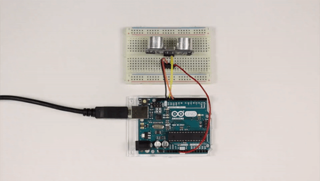

# Medidor de distancias



En esta práctica deberás medir distancias cortas inferiores a 4 metros mediante el sensor de ultrasonidos.

1.  [Materiales](#materiales)
2.  [Esquema eléctrico](#esquema-eléctrico)
3.  [Programación en mBlock](#programación-en-mBlock)
4.  [Programación en Arduino](#programación-en-arduino)


<br /><br />


## Esquema eléctrico

Teniendo en cuenta las características técnicas de los diodos led que utilizamos en esta práctica, calculamos la resistencia del circuito aplicando la Ley de Ohm.

Tenemos que tener en cuenta que el sensor de ultrasonidos tiene un rango de medición inferior a 4 metros y valor obtenido es el tiempo transcurrido desde la emisión del pulso hasta la recepción del cambio de pulso, es decir, cuenta el tiempo de ida + vuelta.

| Sensor de proximidad HC-SR04  |           |
| ----------------------------- | --------- |
| Polarizado                    | Si        |
| Señal de salida               | Digital   |
| Tensión                       | 5V        |
| Rango de medición             | 2cm a 4m  |

Para calcular la distancia tenemos que ayudarnos de la velocidad del sonido para obtener los cálculos. Hay que tener en cuenta que el resultado es el tiempo en ida + vuelta.

```
Velocidad del sonido: 343 m/s
```

Se conectan los componentes sobre la placa de prototipado.


<br /><br />


## Programación en mBlock

Fijándonos en el diagrama de flujo programamos la práctica mediante lenguaje de programación por bloques mBlock. 

Podrás observar el gran parecido que se tiene con el diagrama de flujo.


<br /><br />


## Programación en Arduino

Al igual que en el apartado anterior, programamos en Arduino IDE la práctica propuesta.

```
/**
 * Medidor de distancia
 * 
 * En esta práctica deberás medir distancias cortas inferiores a 4 metros
 * mediante el sensor de ultrasonidos.
 * 
 * @author Miguel Ángel Abellán
 * @company Programo Ergo Sum
 * @license Creative Commons. Reconocimiento CompartirIgual 4.0
 */

// Se definen las variables de tipo entero
int trigPin = 13;
int echoPin = 12;

//Este código se ejecuta la primera vez
void setup() {
  Serial.begin (9600);
  pinMode(trigPin, OUTPUT);
  pinMode(echoPin, INPUT);

  //Inicialización  de los pines
  digitalWrite(trigPin, LOW);
}

//Este código se ejecuta en bucle repetidamente
void loop() {
  
  //Enviamos un pulso durante 10µs
  digitalWrite(trigPin, HIGH);
  delayMicroseconds(10);
  digitalWrite(trigPin, LOW);

  //Obtenemos la duración del pulso (ida+vuelta) en µs
  long tiempo;
  tiempo = pulseIn(echoPin, HIGH);

  //Calculamos la distancia. Velocidad Sonido = 343 m/s
  float distancia = 34300*tiempo*0.000001;
  distancia = distancia / 2; //Solo IDA
  Serial.print("Distancia: ");
  Serial.println(distancia);
}
```


---


<br>
Esta obra está bajo una licencia de [Creative Commons Reconocimiento-CompartirIgual 4.0 Internacional](https://creativecommons.org/licenses/by-sa/4.0/deed.es_ES).