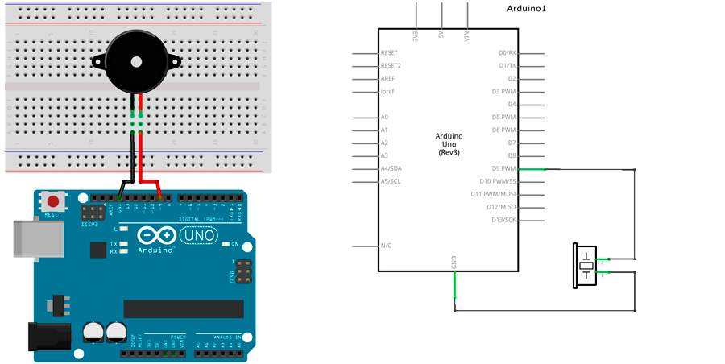

# La Guerra de las Galaxias


A través de un zumbador reproducimos la banda sonora de La Guerra de las Galaxias mediante frecuencias.
 
1.	[Materiales](#materiales)
2.	[Esquema eléctrico](#esquema-eléctrico)
3.	[Programación en mBlock](#programación-en-mBlock)
4.	[Programación en Arduino](#programación-en-arduino)


---


<br><br>


## Materiales

Para llevar a cabo la práctica, vamos a necesitar los siguientes materiales:
- 1 Placa de Arduino UNO
- 1 Protoboard
- 2 latiguillos
- 1 Zumbador


<br><br>


## Esquema eléctrico

Teniendo en cuenta las características técnicas de los diodos led que utilizamos en esta práctica, calculamos la resistencia del circuito aplicando la Ley de Ohm.

| Zumbador piezo-eléctrico         |       |
| -------------------------------- | ----- |
| Polarizado                       | Sí    |
| Tensión de trabajo               | 3-12V |


Se conectan los componentes sobre la placa de prototipado.




<br><br>


## Programación en mBlock

La programación de esta práctica consiste en reproducir las notas musicales siguiendo la partitura de la canción. 


<br><br>


## Programación en Arduino

Al igual que en el apartado anterior, programamos en Arduino IDE la práctica propuesta.

```
/**
 * La Guerra de las Galaxias
 * 
 * A través de un zumbador reproducimos la banda sonora de La Guerra
 * de las Galaxias mediante frecuencias.
 * 
 * @author Miguel Ángel Abellán
 * @company Programo Ergo Sum
 * @license Creative Commons. Reconocimiento CompartirIgual 4.0
 */

// Definimos la variable del zumbador de tipo entero
int zumbadorPin = 9;

// En cada array reproducimos las 5 frecuencias de cada nota
int c[5]={131,262,523,1046,2093}; // Do
int d[5]={147,294,587,1175,2349}; // Re
int e[5]={165,330,659,1319,2637}; // Mi
int f[5]={175,349,698,1397,2794}; // Fa
int g[5]={196,392,784,1568,3136}; // Sol
int a[5]={220,440,880,1760,3520}; // La
int b[5]={247,494,988,1976,3951}; // Si


// Funcion para reproducir una nota durante un determinado tiempo
void nota(int frecuencia, int duracion)
{
  tone(zumbadorPin, frecuencia);
  delay(duracion);
  noTone(zumbadorPin);
  delay(50);

}

//Este código se ejecuta la primera vez
void setup() {

}

//Este código se ejecuta en bucle repetidamente
void loop() {
  nota(f[2],500);
  nota(f[2],500);
  nota(f[2],500);
  nota(d[2],250);
  nota(a[2],250);
  nota(f[2],500);
  nota(d[2],250);
  nota(a[2],250);
  nota(f[2],500);
  delay(500);
  nota(c[3],500);
  nota(c[3],500);
  nota(c[3],500);
  nota(d[3],250);
  nota(a[2],250);
  nota(f[2],500);
  nota(d[2],250);
  nota(a[2],250);
  nota(f[2],500);
  delay(1000);
}
```


---


<br>
Esta obra está bajo una licencia de [Creative Commons Reconocimiento-CompartirIgual 4.0 Internacional](https://creativecommons.org/licenses/by-sa/4.0/deed.es_ES).
