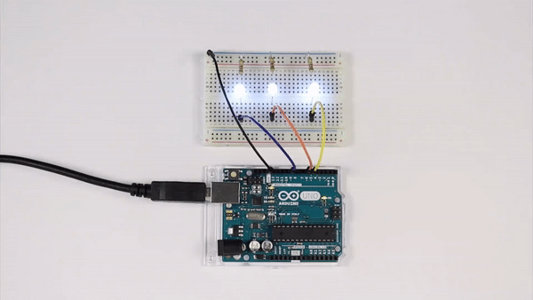
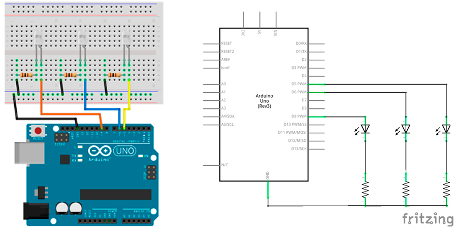

# Luces de navidad



En esta práctica vamos a tratar de encender de forma aleatoria 3 Diodos Led de color blanco utilizando las salidas analógicas y con valores aleatorios.

1.	[Materiales](#materiales)
2.	[Esquema eléctrico](#esquema-eléctrico)
3.	[Programación en mBlock](#programación-en-mblock)
4.	[Programación en Arduino](#programación-en-arduino)


---


<br><br>


## Materiales

Para llevar a cabo la práctica, vamos a necesitar los siguientes materiales:
- 1 Placa de Arduino UNO
- 1 Protoboard
- 4 latiguillos
- 3 Diodos Led (blancos)
- 3 Resistencia 100Ω


<br><br>


## Esquema eléctrico

Teniendo en cuenta las características técnicas de los diodos led que utilizamos en esta práctica, calculamos la resistencia del circuito aplicando la Ley de Ohm.

| Diodos Led                       |        |
| -------------------------------- | ------ |
| Polarizado                       | Sí     |
| Itensidad de Corriente           | 20mA   |
| Tensión Led (verde, ámbar, rojo) | 2,1V   |
| Tensión Led blanco               | 3,3V   |

```
V = 1,7V
I = 20mA

V = I x R ; R = V / I

R = 1,7V / 0,02A = 85Ω 
```

Se conectan los componentes sobre la placa de prototipado.




<br><br>


## Programación en mBlock

La programación de esta práctiac consiste en encender de forma aleatoria los diferentes diodos Led.


<br><br>


## Programación en Arduino

Al igual que en el apartado anterior, programamos en Arduino IDE la práctica propuesta.

```
/**
 * Luces de navidad
 * 
 * En esta práctica vamos a tratar de encender de forma aleatoria
 * 3 Diodos Led de color blanco utilizando las salidas analógicas
 * y con valores aleatorios.
 * 
 * @author Miguel Ángel Abellán
 * @company Programo Ergo Sum
 * @license Creative Commons. Reconocimiento CompartirIgual 4.0
 */

// Definimos las variables de tipo entero
int ledPin1 = 9;
int ledPin2 = 6;
int ledPin3 = 5;
int delayTime = 500;

//Este código se ejecuta la primera vez
void setup() {
  // Configuramos los pines en modo salida
  pinMode(ledPin1, OUTPUT);
  pinMode(ledPin2, OUTPUT);
  pinMode(ledPin3, OUTPUT);
  // Inicializamos los pines a un valor BAJO
  analogWrite(ledPin1, 0);
  analogWrite(ledPin2, 0);
  analogWrite(ledPin3, 0);
}

//Este código se ejecuta en bucle repetidamente
void loop() {
  // Escribimos el valor aleatorio en cada pin
  analogWrite(ledPin1, random(0, 255));
  analogWrite(ledPin2, random(0, 255));
  analogWrite(ledPin3, random(0, 255));
  // Esperamos
  delay(delayTime);

}
```


---


<br>
Esta obra está bajo una licencia de [Creative Commons Reconocimiento-CompartirIgual 4.0 Internacional](https://creativecommons.org/licenses/by-sa/4.0/deed.es_ES).
