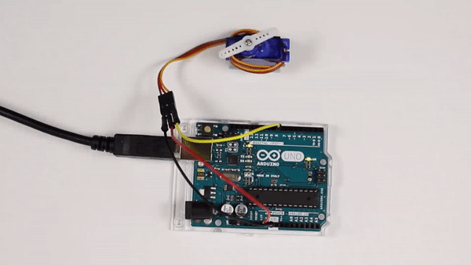
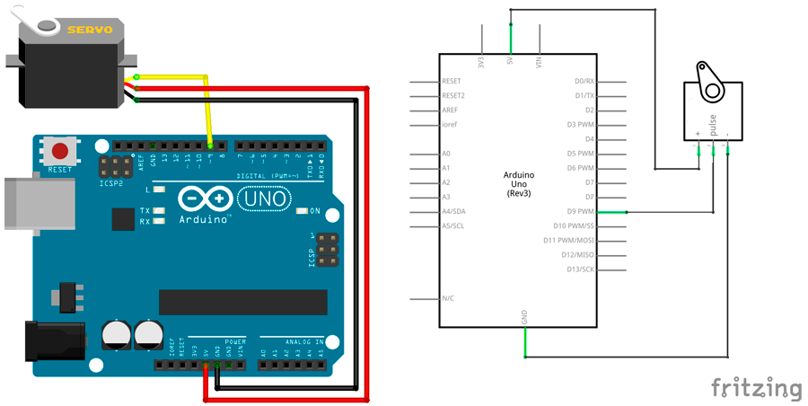

# Movimiento de un servomotor



En esta práctica el servomotor se mueve desde su posición origen a su posición final en ángulos de 10° repetidamente.

1.	[Materiales](#materiales)
2.	[Esquema eléctrico](#esquema-eléctrico)
3.	[Programación en mBlock](#programación-en-mblock)
4.	[Programación en Arduino](#programación-en-arduino)


---


<br><br>


## Materiales

Para llevar a cabo la práctica, vamos a necesitar los siguientes materiales:
- 1 Placa de Arduino UNO
- 3 latiguillos
- 1 Servomotor


<br><br>


## Esquema eléctrico

Teniendo en cuenta las características técnicas de los diodos led que utilizamos en esta práctica, calculamos la resistencia del circuito aplicando la Ley de Ohm.

| Servo motores      |                  |
| ------------------ | ---------------- |
| Polarizado         | Sí               |
| Tensión operativa  | 4,8V             |
| Rotación           | 0° a 180°        |
| Torque estático    | 4,5V > 1,5Kg/cm  |

Se conectan los componentes sobre la placa de prototipado.




<br><br>


## Programación en mBlock

La programación de esta práctica consiste en mover el servomotor desde un ángulo hasta otro dado.


<br><br>


## Programación en Arduino

Al igual que en el apartado anterior, programamos en Arduino IDE la práctica propuesta.

```
/**
 * Movimiento de un servomotor
 * 
 * En esta práctica el servomotor se mueve desde su posición origen a 
 * su posición final en ángulos de 10° repetidamente.
 * 
 * @author Miguel Ángel Abellán
 * @company Programo Ergo Sum
 * @license Creative Commons. Reconocimiento CompartirIgual 4.0
 */

// Importamos la librería del servomotor
#include <Servo.h>

// Definimos la variable de tipo servo
Servo servomotor;

//Este código se ejecuta la primera vez
void setup() {
  // Configuramos los pines en modo salida
  servomotor.attach(9);
}

//Este código se ejecuta en bucle repetidamente
void loop() {
  for(int i=0; i<=180; i+=10){
    servomotor.write(i);
    delay(100);
  }
  for(int i=180; i>=0; i-=10){
    servomotor.write(i);
    delay(100);
  }
}
```


---


<br>
Esta obra está bajo una licencia de [Creative Commons Reconocimiento-CompartirIgual 4.0 Internacional](https://creativecommons.org/licenses/by-sa/4.0/deed.es_ES).
