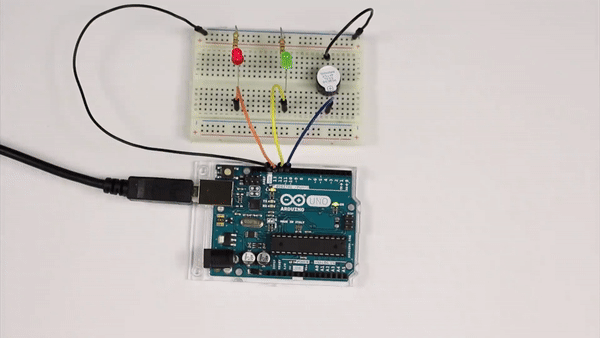

# Semáforo para invidentes



En esta práctica vamos a simular el semáforo para peatones invidentes a través de 1 zumbador que avisa al peatón.

1.	[Materiales](#materiales)
2.	[Esquema eléctrico](#esquema-eléctrico)
3.	[Programación en mBlock](#programación-en-mBlock)
4.	[Programación en Arduino](#programación-en-arduino)


---


<br><br>


## Materiales

Para llevar a cabo la práctica, vamos a necesitar los siguientes materiales:
- 1 Placa de Arduino UNO
- 1 Protoboard
- 5 latiguillos
- 2 Diodo Led
- 2 Resistencia de 220Ω
- 1 Zumbador


<br /><br />


## Esquema eléctrico

Teniendo en cuenta las características técnicas de los diodos led que utilizamos en esta práctica, calculamos la resistencia del circuito aplicando la Ley de Ohm.

| Diodos Led                       |        |
| -------------------------------- | ------ |
| Polarizado                       | Sí     |
| Diámetro                         | 5mm    |
| Itensidad de Corriente           | 20mA   |
| Tensión Led (verde, ámbar, rojo) | 2,1V   |
| Tensión Led blanco               | 3,3V   |

| Zumbador piezo-eléctrico         |       |
| -------------------------------- | ----- |
| Polarizado                       | Sí    |
| Tensión de trabajo               | 3-12V |


```
V = 2,9V
I = 20mA

V = I x R ; R = V / I

R = 2,9V / 0,02A = 145Ω 
```

Se conectan los componentes sobre la placa de prototipado.


<br /><br />


## Programación en mBlock

Para encender y apagar los leds y zumbador del semáforo, utilizamos un bucle repetir. Dentro del bucle se añaden las instrucciones de apagar y encender cada led, dejando la espera correspondiente.


<br /><br />


## Programación en Arduino

Al igual que en el apartado anterior, programamos en Arduino IDE la práctica propuesta.

```
/**
 * Semáforo para invidentes
 *
 * En esta práctica vamos a simular el semáforo para peatones invidentes 
 * a través de 1 zumbador que avisa al peatón.
 *
 * @author Miguel Ángel Abellán
 * @company Programo Ergo Sum
 * @license Creative Commons. Reconocimiento CompartirIgual 4.0
 */

// Definimos las variables de tipo entero
int ledPinRojo = 13;
int ledPinVerde = 12;
int ledPinZumbador = 11;

//Este código se ejecuta la primera vez
void setup() {
  // Configuramos los pines en modo salida
  pinMode(ledPinRojo, OUTPUT);
  pinMode(ledPinVerde, OUTPUT);
  pinMode(ledPinZumbador, OUTPUT);
  // Inicializamos los pines a un valor BAJO
  digitalWrite(ledPinRojo, LOW);
  digitalWrite(ledPinVerde, LOW);
  digitalWrite(ledPinZumbador, LOW);
}

//Este código se ejecuta en bucle repetidamente
void loop() {
  // Mostramos el led de color rojo
  digitalWrite(ledPinRojo, HIGH);
  delay(5000);
  digitalWrite(ledPinRojo, LOW);
  
  // Mientras el semáforo está en verde suena el zumbador
  digitalWrite(ledPinVerde, HIGH);
  for(int i=0; i<10; i++){
    digitalWrite(ledPinZumbador, HIGH);
    delay(200);
    digitalWrite(ledPinZumbador, LOW);
    delay(500);
  }
  digitalWrite(ledPinVerde, LOW);
}
```


---


<br>
Esta obra está bajo una licencia de [Creative Commons Reconocimiento-CompartirIgual 4.0 Internacional](https://creativecommons.org/licenses/by-sa/4.0/deed.es_ES).