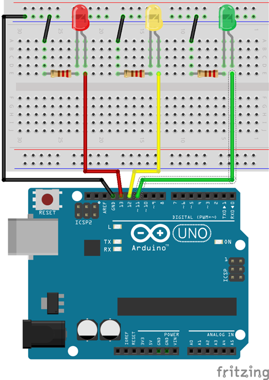

# Semáforo simple


En esta práctica vamos a crear un semáforo simple con una frecuencia de cambio de 5 segundos en verde y rojo, y 1 segundo durante su estado en ámbar.

1.  [Materiales](#materiales)
2.  [Esquema eléctrico](#esquema-eléctrico)
3.  [Programación en mBlock](#programación-en-mBlock)
4.  [Programación en Arduino](#programación-en-arduino)


---


<br><br>


## Materiales

Para llevar a cabo la práctica, vamos a necesitar los siguientes materiales:
- 1 Placa de Arduino UNO
- 1 Protoboard
- 4 latiguillos
- 3 Diodo Led
- 3 Resistencia de 220Ω


<br /><br />


## Esquema eléctrico

Teniendo en cuenta las características técnicas de los diodos led que utilizamos en esta práctica, calculamos la resistencia del circuito aplicando la Ley de Ohm.

| Diodos Led                       |        |
| -------------------------------- | ------ |
| Polarizado                       | Sí     |
| Diámetro                         | 5mm    |
| Itensidad de Corriente           | 20mA   |
| Tensión Led (verde, ámbar, rojo) | 2,1V   |
| Tensión Led blanco               | 3,3V   |


```
V = 2,9V
I = 20mA

V = I x R ; R = V / I

R = 2,9V / 0,02A = 145Ω 
```

Se conectan los componentes sobre la placa de prototipado.




<br /><br />


## Programación en mBlock

Para encender y apagar los leds, utilizamos un bucle repetir. Dentro del bucle se añaden las instrucciones de apagar y encender cada led, dejando la espera correspondiente.


<br /><br />


## Programación en Arduino

Al igual que en el apartado anterior, programamos en Arduino IDE la práctica propuesta.

```
/**
 * Semáforo simple
 *
 * En esta práctica vamos a crear un semáforo simple con una frecuencia de cambio
 * de 5 segundos en verde y rojo, y 1 segundo durante su estado en ámbar.
 *
 * @author Miguel Ángel Abellán
 * @company Programo Ergo Sum
 * @license Creative Commons. Reconocimiento CompartirIgual 4.0
 */

void setup() {
  pinMode(13, OUTPUT);
  pinMode(12, OUTPUT);
  pinMode(11, OUTPUT);
  digitalWrite(13, LOW);
  digitalWrite(12, LOW);
  digitalWrite(11, LOW);
}

void loop() {
  digitalWrite(13, LOW);
  digitalWrite(11, HIGH);
  delay(5000);
  digitalWrite(11, LOW);
  digitalWrite(12, HIGH);
  delay(1000);
  digitalWrite(12, LOW);
  digitalWrite(13, HIGH);
  delay(5000);
}
```


---


<br>
Esta obra está bajo una licencia de [Creative Commons Reconocimiento-CompartirIgual 4.0 Internacional](https://creativecommons.org/licenses/by-sa/4.0/deed.es_ES).
