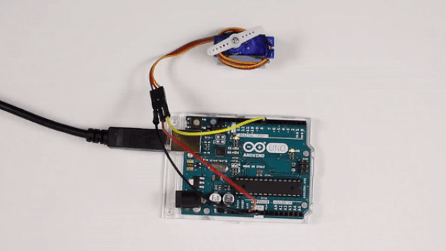
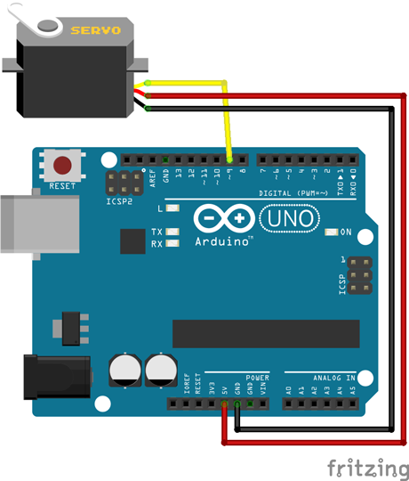
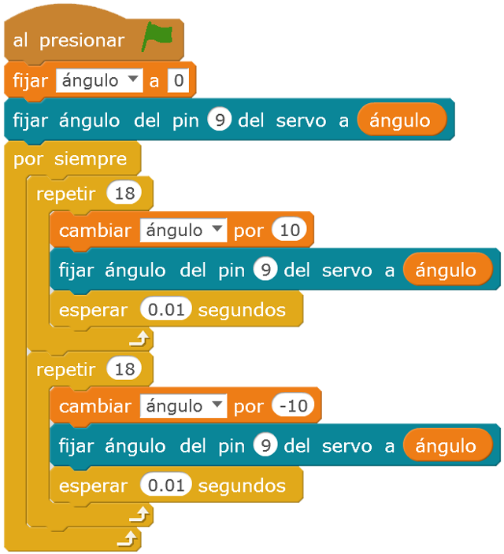

# Práctica 4: Servomotor 0º-180º

El objetivo de esta práctica consiste en mover un servomotor desde su posición o ángulo de 0º hasta 180º y vuelta a empezar, de forma repetida. Además, se desplazará de 10º en 10º.




---


<br><br>


## Materiales

- 1 Arduino UNO
- 3 Latiguillos
- 1 Servomotor


<br><br>


## Esquema eléctrico

| Servo motores      |                  |
| ------------------ | ---------------- |
| Polarizado         | Sí               |
| Tensión operativa  | 5V               |
| Rotación           | 0° a 180°        |

Conectamos el cable rojo (positivo del servomotor) al pin 5V de la placa de arduino, el cable negro (negativo del servomotor) al pin GND de la placa de arduino y el color amarillo al pin analógico PWM 9 de la placa de arduino.




<br><br>


## Programación en mBlock

Al ejecutar el código se crea una variable encargada de almacenar el ángulo del servomotor, que por defecto empezará en su posición de 0º. A continuación se repite 18 veces el cambio de ángulo por 10º esperando una décima de segundo. De esta forma el servomotor se desplazará hasta la posición 180º. Y como tiene que regresar se vuelve a crear un bucle pero en este caso la variable irá decrementando de 10º en 10º.




<br><br>


## Programación en Arduino

En primer lugar, se importa la librería a utilizar <Servo.h> y se inicializa el objeto llamado servomotor. Además se configura el pin analógico PWM 9 a utilizar por el servomotor. Esta configuración se establece en la función setup(), ya que solamente se ejecuta una vez.

Por otro lado, al ejecutar el código se recorre 18 veces el cambio de ángulo por 10º esperando una décima de segundo. De esta forma el servomotor se desplazará hasta la posición 180º. Y como tiene que regresar se vuelve a crear un bucle pero en este caso la variable irá decrementando de 10º en 10º.

```
/**
 * Servomotor 0-180
 * 
 * @author Miguel Ángel Abellán
 * @company Programo Ergo Sum
 * @license Creative Commons. Reconocimiento CompartirIgual 4.0
 */

#include <Servo.h>

Servo servomotor;

void setup() {
  servomotor.attach(9);
}

void loop() {
  for(int i=0; i<=180; i+=10){
    servomotor.write(i);
    delay(100);
  }
  for(int i=180; i>=0; i-=10){
    servomotor.write(i);
    delay(100);
  }
}
```


---


<br>
Esta obra está bajo una licencia de [Creative Commons Reconocimiento-CompartirIgual 4.0 Internacional](https://creativecommons.org/licenses/by-sa/4.0/deed.es_ES).

2018 [Asociación Programo Ergo Sum](https://www.programoergosum.com)