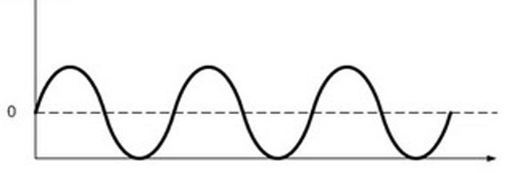
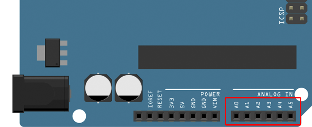

## Entradas analógicas

Una señal analógica es aquella que puede tomar diferentes valores. Su forma característica es conocida como señal de onda senoidal y las representaciones se realizan en el dominio del tiempo. La función principal de las salidas analógicas es entregar una señal de control que le dará funcionalidad a un circuito electrónico que será el encargado de cumplir con las funciones que el usuario requiera.

 

En arduino disponemos de 6 pines para entradas analógicas serigrafiados con los números del A0 al A5. Estos pines son utilizados únicamente como entradas analógicas.

La entrada analógica toma los valores comprendidos entre 0 y 1023.

Es importante recordar que no podemos sobrepasar los límites de voltaje permitidos, es decir, si se aplica un voltaje mayor a 5 voltios en una entrada digital, la placa de arduino se quemará. Lo mismo aplica para voltajes negativos, por lo que debemos asegurar que el voltaje aplicado a una entrada digital se encuentre entre 0 y 5 voltios.
