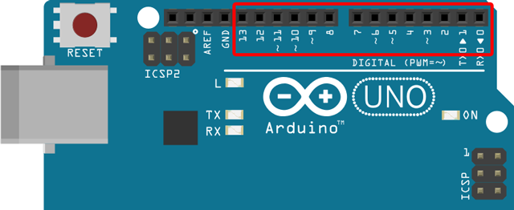

# Salidas digitales

En este capítulo aprenderás a programar diferentes prácticas utilizando las salidas digitales de la placa de arduino. Para cada una se explica la parte de electrónica que deberás conocer antes de programarlas. Observarás además que puedes programarlas utilizando los lenguajes de programación por bloques o textual de Arduino.

---

  

## Salidas digitales

Una señal digital es aquella que sólo puede tomar ciertos valores (alto o bajo). Su forma característica es conocida como señal de onda cuadrada y las representaciones se realizan en el dominio del tiempo. La función principal de las salidas digitales es entregar una señal de control que le dará funcionalidad a un circuito electrónico que será el encargado de cumplir con las funciones que el usuario requiera.

 

En arduino disponemos de 14 pines digitales serigrafiados con los números del 0 al 13. Estos pines son utilizados en modo digital para entradas y salidas, incluso algunos de ellos, serigrafiados con el símbolo de alterna (~), pueden ser también utilizados como pines de salida analógica en modo PWM.

La salida digital toma los valores 0V (bajo) ó 5V (alto).

Los pines de salida han sido diseñados para entregar señales de voltaje, no para suplir corriente a un circuito. El máximo de corriente que puede entregar un pin de salida es de aproximadamente 40mA (suficiente para encender un LED). Las cargas que vamos a manejar no deben superar los 5V ni consumir más de 40mA.

 

 

## Prácticas

* [Luz intermitente](/Practicas/Luz-intermitente/README.md)
* [Luz alterna](/Practicas/Luz-alterna/README.md)
* [Semáforo simple](/Practicas/Semaforo-simple/README.md)
* [Semáforo peatones](/Practicas/Semaforo-peatones/README.md)
* [Coche fantástico](/Practicas/Coche-fantastico/README.md)