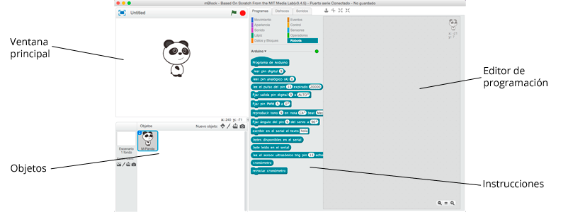

# Scratch 4 Arduino

Scratch 4 Arduino **(S4A)** es una modificación del software libre de Scratch que nos permite crear programas para Arduino, pero tenemos que tener en cuenta que los proyectos siempre serán dependientes de la conexión con S4A, es decir, debemos tener S4A ejecutándose en nuestro equipo al mismo tiempo.

Está basado en el lenguaje de programación por bloques y sus instrucciones han sido diseñadas con un lenguaje natural, eliminando términos técnicos y empleando una terminología más natural. Así se facilita el acceso a la programación en niveles educativos básicos.

 

## Instalar Scratch 4 Arduino
 
Independientemente del sistema operativo que utilicemos, desde la [web del proyecto](http://s4a.cat) está disponible para Windows, Linux y Mac, siendo la instalación similar.

Para instalar S4A en nuestro equipo debemos seguir los siguientes pasos:

1. Tener instalado Arduino IDE en primer lugar (véase sección).
2. Cargar un pequeño programa o [firmware](#cargar-el-firmware) en la placa de Arduino.
3. Instalar S4A desde la web [s4a.cat](http://s4a.cat) siguiendo los pasos de instalación. 

 

## Cargar el Firmware

Para que S4A reconozca y se comunique con la tarjeta de Arduino, debemos cargar un firmware o controlador en la misma. Para ello debemos seguir los siguientes pasos:

1. Abrir el archivo [S4AFirmware16.ino](http://vps34736.ovh.net/S4A/S4AFirmware16.ino) con Arduino IDE.
2. Cargar el firmware en la placa de Arduino habiendo comprobado previamente que la placa de Arduino ha sido detectada por nuestro equipo y funciona correctamente.
3. Probar que detecta correctamente nuestra placa en S4A.

  
---
  

# Snap 4 Arduino

Snap 4 Arduino **(S4A)** es una modificación del software libre de Snap que nos permite crear programas para Arduino, pero tenemos que tener en cuenta que los proyectos siempre serán dependientes de la conexión con S4A, es decir, debemos tener S4A ejecutándose en nuestro equipo al mismo tiempo.

Está basado en el lenguaje de programación por bloques y sus instrucciones han sido diseñadas con un lenguaje natural, eliminando términos técnicos y empleando una terminología más natural. Así se facilita el acceso a la programación en niveles educativos básicos.

 

## Instalar Snap 4 Arduino
 
Independientemente del sistema operativo que utilicemos, desde la [web del proyecto](http://snap4arduino.rocks/) está disponible para Windows, Linux y Mac, siendo la instalación similar.

Para instalar S4A en nuestro equipo debemos seguir los siguientes pasos:

1. Tener instalado Arduino IDE en primer lugar (véase sección).
2. Cargar un pequeño programa o [firmware](#cargar-el-firmware) en la placa de Arduino.
3. Instalar S4A desde la web [snap4arduino](http://snap4arduino.rocks/) siguiendo los pasos de instalación. 

 

## Cargar el Firmware

Para que S4A reconozca y se comunique con la tarjeta de Arduino, debemos cargar un firmware o controlador en la misma. Para ello debemos seguir los siguientes pasos:

1. Abrir el archivo 'File → Examples → Firmata → StandardFirmata' con Arduino IDE.
2. Cargar el firmware en la placa de Arduino habiendo comprobado previamente que la placa de Arduino ha sido detectada por nuestro equipo y funciona correctamente.
3. Probar que detecta correctamente nuestra placa en S4A.

  
---
  

# mBlock

mBlock es un entorno gráfico de programación basado en Scratch 2.0 y desarrollado por la empresa MakeBlock, para programar placas de prototipado basadas en Arduino, entre otros. Scratch está pensado para programar videojuegos mientras que mBlock está pensado para programar robots.

Está basado en el lenguaje de programación por bloques y sus instrucciones han sido diseñadas con un lenguaje natural, eliminando términos técnicos y empleando una terminología más natural. Así se facilita el acceso a la programación en niveles educativos básicos.

 

## Instalar mBlock
 
Independientemente del sistema operativo que utilicemos, desde la [web del proyecto](https://www.makeblock.es/soporte/mblock/) está disponible para Windows, Linux y Mac, siendo la instalación similar.

Para instalar mBlock en nuestro equipo debemos seguir los siguientes pasos:

1. Conectar el puerto USB
2. Elegir placa
3. Elegir extensión
4. Actualizar firmware
5. Programar y depurar el código
6. Subir el programa a Arduino

  
---
  

# Arduino IDE

Arduino IDE es un editor de texto y compilador para programar y transferir el contenido de las instrucciones a la placa de Arduino en su lenguaje máquina. El lenguaje de programación utilizado es Processing.

 

## Instalar mBlock
 
Independientemente del sistema operativo que utilicemos, desde la [web del proyecto](https://www.arduino.cc/en/Main/Software/) está disponible para Windows, Linux y Mac, siendo la instalación similar.
