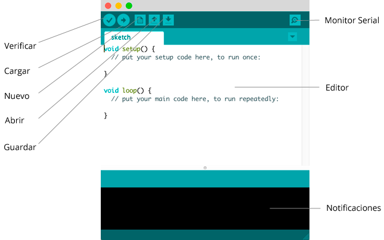

# mBlock

mBlock es un entorno gráfico de programación basado en Scratch 2.0 y desarrollado por la empresa MakeBlock, para programar placas de prototipado basadas en Arduino, entre otros. Scratch está pensado para programar videojuegos mientras que mBlock está pensado para programar robots.

Está basado en el lenguaje de programación por bloques y sus instrucciones han sido diseñadas con un lenguaje natural, eliminando términos técnicos y empleando una terminología más natural. Así se facilita el acceso a la programación en niveles educativos básicos.

 

## Instalar mBlock
 
Independientemente del sistema operativo que utilicemos, desde la [web del proyecto](https://www.makeblock.es/soporte/mblock/) está disponible para Windows, Linux y Mac, siendo la instalación similar.

Para instalar mBlock en nuestro equipo debemos seguir los siguientes pasos:

1. Conectar el puerto USB
2. Elegir placa
3. Elegir extensión
4. Actualizar firmware
5. Programar y depurar el código
6. Subir el programa a Arduino

  
---
  

# Arduino IDE

Arduino IDE es un editor de texto y compilador para programar y transferir el contenido de las instrucciones a la placa de Arduino en su lenguaje máquina. El lenguaje de programación utilizado es Processing.

 

## Instalar mBlock
 
Independientemente del sistema operativo que utilicemos, desde la [web del proyecto](https://www.arduino.cc/en/Main/Software/) está disponible para Windows, Linux y Mac, siendo la instalación similar.
