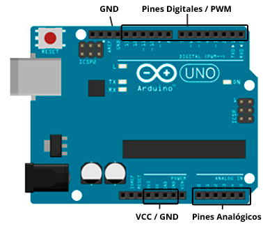

# Primeros pasos con Arduino

En este apartado se explica cómo instalar y configurar tu placa de arduino así como los diferentes programas que se van a utilizar en las prácticas de programación y robótica de este manual.

 

## Qué es Arduino

**Arduino** es una plataforma para prototipado de electrónica basada en hardware y software libre y fácil de utilizar. Podemos construir circuitos electrónicos y programarlos para:
- iniciarnos en el mundo de la electrónica y robótica.
- construir componentes electrónicos a nuestro gusto.
- crear nuestro propio modelo de negocio.

 

Arduino se apoya en 2 pilares fundamentales; [Hardware](#hardware-de-arduino) (placa de Arduino) y [Software](#software-de-arduino) (entorno de programación).

### Hardware de Arduino

Las principales características que podemos encontrar en nuestra placa de Arduino UNO Rev3, son las siguientes:
- El microcontrolador es un **circuito integrado programable** capaz de realizar operaciones matemáticas complejas a gran velocidad.
- Normalmente el modo de alimentación de una placa de Arduino es mediante el puerto USB mientras se está programando, pero hay ocasiones en la que necesitamos que el código de nuestra placa se siga ejecutándose sin estar conectado al equipo. Probablemente la forma más habitual de alimentar Arduino (sin utilizar tu equipo) es mediante una fuente de alimentación o pila de 9V. 
- Arduino dispone de un **regulador de voltaje interno** que actúa para que la tensión de alimentación no supere los 12V, ya que en caso contrario podemos dañar el regulador y con ello la placa de Arduino. Por otro lado, para tensiones inferiores a 7V en la alimentación, es probable que la placa no llegue a encenderse. La mayoría de los componentes electrónicos de Arduino utilizan una **tensión operativa de 5V** (ya regulada por el regulador de voltaje de la propia placa de Arduino).
- Tanto las **entradas** como las **salidas** dotan al sistema de información y realizan diferentes actuaciones.

| Características Arduino UNO Rev3           |           |
| ------------------------------------------ | --------- |
| Microcontrolador                           | ATmega328 |
| Tensión operativa                          | 5V        |
| Tensión de alimentación                    | 7-12V     |
| Máxima VC para entradas                    | 40mA      |
| Máxima VC para pines 3.3V                  | 50mA      |
| Entradas digitales                         | 14        |
| Salidas digitales                          | 14        |
| Entradas analógicas                        | 6         |
| Memoria flash                              | 32Kb      |
| SRAM                                       | 2Kb       |
| EEPROM                                     | 1Kb       |

 

Arduino contiene la siguiente distribución de pines:
- Disponemos de **14 pines digitales** que pueden ser configurados como entradas o salidas, de los cuales (serigrafiadas con el símbolo ~) pueden ser utilizados como señales digitales **PWM 6 pines**.
- Igualmente diponemos de **6 pines analógicos** serigrafiadas desde A0 hasta A5 para las entradas analógicas.
- También disponemos de **3 pines GND** para conectar a tierra nuestros circuitos.
- Y por último **2 pines de alimentación** de 5V y 3.3V respectivamente.

| Pines Arduino UNO Rev3  |           |
| ----------------------- | --------- |
| Entradas digitales      | 14        |
| Salidas digitales       | 14        |
| Salidas PWM       	  | 6         |
| Entradas analógicas     | 6         |
| GND (tierra)            | 3         |
| VCC 3.3V                | 1         |
| VCC 5V                  | 1         |

 

### Software de Arduino

Para programar una tarjeta de Arduino, podemos utilizar diferentes lenguajes y entornos de programación. En este caso vamos a introducir la programación y electrónica con Arduino utilizando los lenguajes de programación por bloques y lenguajes de programación en modo texto.

- Lenguajes de programación por bloques:
	- [Scratch 4 Arduino](Scratch-4-arduino/README.md)
	- [Snap 4 Arduino](Snap-4-arduino/README.md)
	- [mBlock](mBlock/README.md)
- Lenguajes de programación en modo texto
	- [Arduino IDE](Arduino-ide/README.md)

---

 
Esta obra está bajo una licencia de [Creative Commons Reconocimiento-CompartirIgual 4.0 Internacional](https://creativecommons.org/licenses/by-sa/4.0/deed.es_ES).