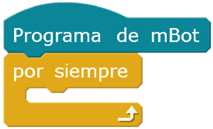
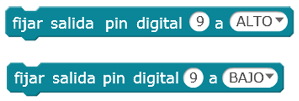
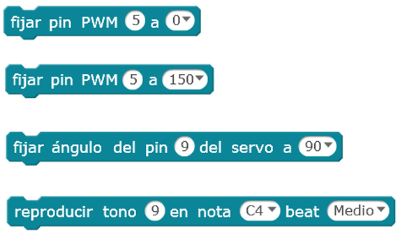

# Programación > mBlock

Para programar una tarjeta de Arduino, podemos utilizar el lenguaje de programación por bloques de mBlock.

- [Estructura de control](#estructura-de-control)
- [Salidas digitales](#salidas-digitales)
- [Salidas analógicas](#salidas-analogicas)
- [Entradas digitales](#entradas-digitales)
- [Entradas analógicas](#entradas-analogicas)

---

  

## Estructura de control

Si todavía no conoces el lenguaje de programación por bloques de Scratch, accede a los [tutoriales para aprender a programar con Scratch](https://www.programoergosum.com/cursos-online/scratch) antes de realizar las siguientes prácticas.

 

 

 

## Salidas digitales

El primer bloque activa el pin digital número 13 de la placa de arduino a un valor alto, con lo cual si conectamos un LED  correctamente se encenderá. Por otro lado, con el segundo bloque ocurre justamente lo contrario.

Los pines para las salidas digitales corresponden a los pines desde el 0 hasta el 13 y toman los valores ALTO o BAJO.

 

 

 

## Salidas analógicas

El primer bloque activa el pin analógico PWM número 5 de la placa de arduino a un valor de 0, con lo cual si conectamos un LED correctamente se apagará. Por otro lado, si cambiamos el valor por 150 observaremos que el LED se ilumina con una intensidad media.

También disponemos de un bloque encargado de hacer girar un servomotor entre 0º y 180º y otro bloque para reproducir frecuencias en el zumbador.

Los pines para las salidas analógicas PWM corresponden a los pines 11, 10, 9, 6, 5 y 3 y pueden tomar valores comprendidos entre 0 y 255, o entre 0 y 180 para el caso de los servomotores.

 

 

## Entradas digitales

El primer bloque recibe el valor del pin digital 9 de la placa de arduino. Por otro lado, el segundo bloque es utilizado en los sensores de ultrasonidos, y devuelve la distancia en centímetros del objeto más cercano al sensor (como se explica en la siguiente lección).

Los pines para las entradas digitales corresponden a los pines desde el 0 hasta el 13 y toman los valores ALTO o BAJO.

 

 

## Entradas analógicas

El primer bloque recibe el valor del pin digital 9 de la placa de arduino. Por otro lado, el segundo bloque es utilizado en los sensores de ultrasonidos, y devuelve la distancia en centímetros del objeto más cercano al sensor (como se explica en la siguiente lección).

Los pines para las entradas digitales corresponden a los pines desde el 0 hasta el 13 y toman los valores ALTO o BAJO.

