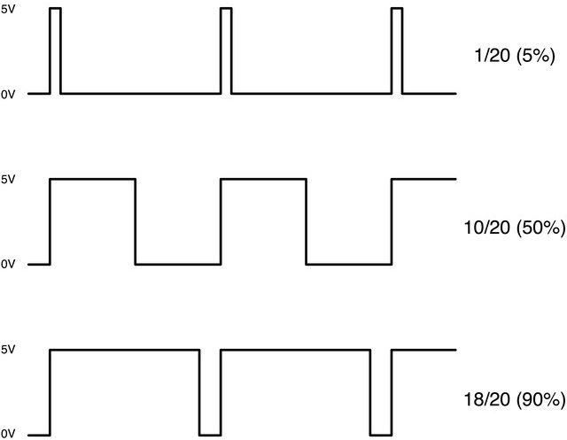
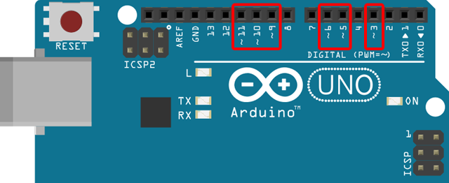

# Salidas analogicas

En este capítulo aprenderás a programar diferentes prácticas utilizando las salidas analógicas de la placa de arduino. Para cada una se explica la parte de electrónica que deberás conocer antes de programarlas. Observarás además que puedes programarlas utilizando los lenguajes de programación por bloques o textual de Arduino.

---

  

## ¿Qué es una señal analógica?

Una señal analógica es aquella que puede tomar diferentes valores. Su forma característica es conocida como señal de onda senoidal y las representaciones se realizan en el dominio del tiempo. La función principal de las salidas analógicas es entregar una señal de control que le dará funcionalidad a un circuito electrónico que será el encargado de cumplir con las funciones que el usuario requiera.

 

## Salidas analógicas en Arduino

En electrónica se suele utilizar un convertidor de digital a analógico (DAC) para transformar la señal digital en analógica, sin embargo arduino no incluye un DAC dentro de los circuitos que forman la placa, con lo cual no son capaces de producir salidas analógicas. Sin embargo son capaces de producir una señal analógica modulada por pulso PWM.

En Arduino UNO no tenemos una señal analógica pura, es decir, se utiliza la técnica PWM.

 

## Salidas PWM en Arduino

PWM (modulación por ancho o de pulso) es un tipo de señal de voltaje utilizada para enviar información o para modificar la cantidad de energía que se envía a una carga. Este tipo de señales es muy utilizada en circuitos digitales que necesitan emular una señal analógica, en las cuales se les cambia el ancho relativo respecto al período de la misma, el resultado de este cambio es llamado ciclo de trabajo y sus unidades están representadas en términos de porcentaje.

En arduino disponemos de 6 pines analógicos PWM serigrafiados con el símbolo de alterna (~) con los números 11, 10, 9, 6, 5, 3.

La salida analógica PWM toma los valores comprendidos entre 0 y 255.

Los pines de salida han sido diseñados para entregar señales de voltaje, no para suplir corriente a un circuito. El máximo de corriente que puede entregar un pin de salida es de aproximadamente 40mA (suficiente para encender un LED). Las cargas que vamos a manejar no deben superar los 5V ni consumir más de 40mA.