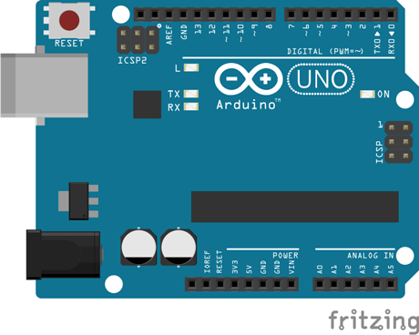
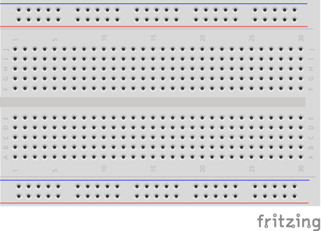
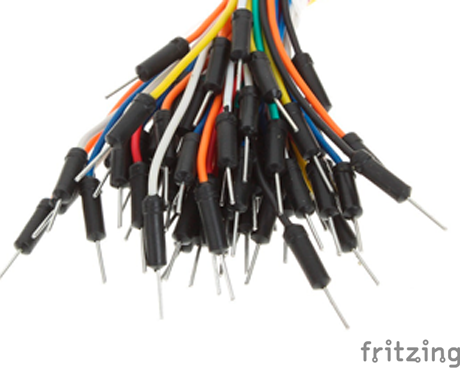
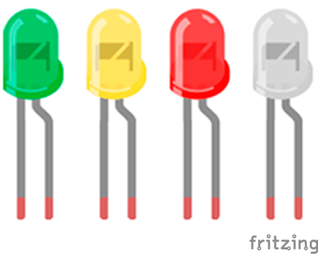
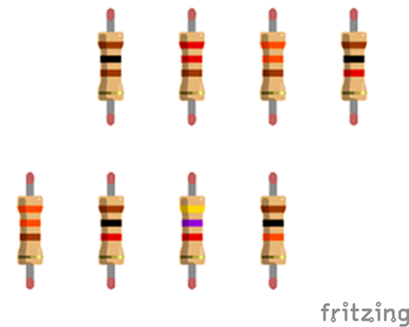
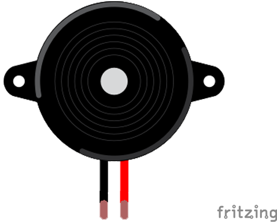

# Materiales

Para el desarrollo de las prácticas de este capítulo, se van a utilizar los siguientes componentes:

## Arduino UNO Rev3

**Arduino** es una plataforma para prototipado de electrónica basada en hardware y software libre, es decir, podemos construir circuitos eléctricos y programarlos.

#### *Características*

| Arduino UNO Rev3          |           |
| ------------------------- | --------- |
| Microprocesador           | ATmega328 |
| Tensión operativa         | 5V        |
| Tensión de alimentación   | 7-12V     |
| Entradas digitales        | 14        |
| Salidas digitales         | 14        |
| Entradas analógicas       | 6         |
| Memoria flash             | 32Kb      |
| SRAM                      | 2Kb       |
| EEPROM                    | 1Kb       |
| Velocidad del reloj       | 16MHz     |
| Máxima VC para entradas   | 40mA      |
| Máxima VC para pines 3.3V | 50mA      |

  

## Placa de prototipado o protoboard

Una **protoboard** es una placa para prototipar circuitos eléctricos conectandos en sus orificios sin necesidad de soldar los componentes.

#### *Características*

| Protoboard  |                 |
| ----------- | --------------- |
| Contactos   | 830 puntos      |
| Serigrafías | Sí, polarizadas |

  

## Latiguillos macho-macho

Los **latiguillos** son utilizados para conectar entre si los diferentes componentes electrónicos.

#### *Características*

| Latiguillos |                           |
| ----------- | ------------------------- |
| Longitud    | 20cm                      |

  

## Diodos LED

Un **diodo Led** es un componente eléctrico que emite luz al paso de corriente eléctrica sobre él, desde el polo positivo (ánodo) al polo negativo (cátodo).

#### *Características*

| Diodos Led de colores            |        |
| -------------------------------- | ------ |
| Polarizado                       | Sí     |
| Diámetro                         | 5mm    |
| Intensidad de Corriente          | 20mA   |
| Tensión Led (verde, ámbar, rojo) | 2,1V   |
| Tensión Led blanco               | 3,3V   |

  

## Resistencias

Los **resistores** son un componente eléctrico que se oponen el paso de la corriente en un circuito. 
- 100Ω (marrón-negro-marrón)
- 220Ω (rojo-rojo-marrón)
- 330Ω (naranja-naranja-marrón)
- 1KΩ (marrón-negro-rojo)
- 4,7KΩ (amarillo-morado-rojo)
- 10KΩ (marrón-negro-naranja)

#### *Características*

| Resistencia                      |      |
| -------------------------------- | ---- |
| Polarizado                       | No   |
| Potencia de disipación           | 0,5W |
| Precisión                        | 5%   |

  

## Zumbador piezo-eléctrico

Un **zumbador** es un componente eléctrico que emite una frecuencia de sonidos al paso de la corriente eléctrica sobre él desde el polo positivo (ánodo) al polo negativo (cátodo).

#### *Características*

| Zumbador piezo-eléctrico         |       |
| -------------------------------- | ----- |
| Polarizado                       | Sí    |
| Tensión de trabajo               | 3-12V |

  

---

 
Esta obra está bajo una licencia de [Creative Commons Reconocimiento-CompartirIgual 4.0 Internacional](https://creativecommons.org/licenses/by-sa/4.0/deed.es_ES).

2018 [Asociación Programo Ergo Sum](https://www.programoergosum.com)